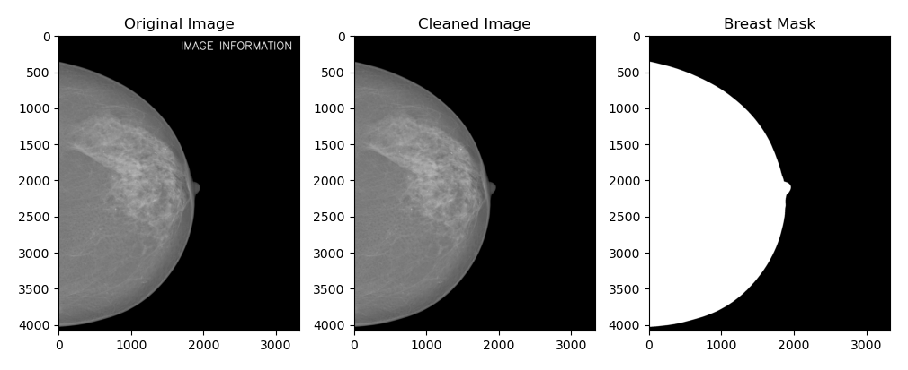
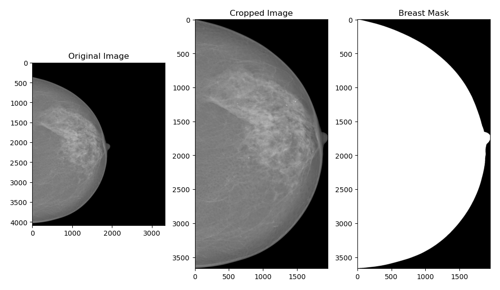
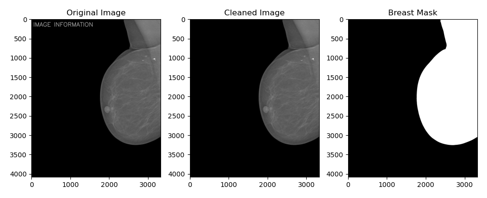
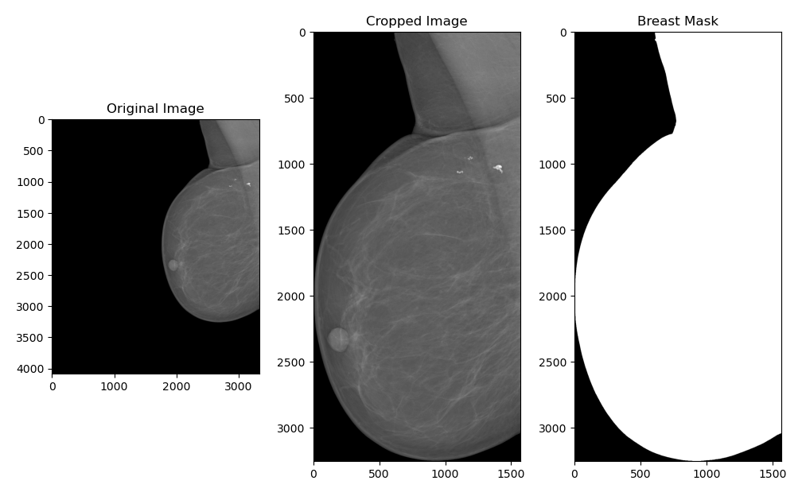

# Mammogram_Breast_Crop_Algorithm

## Description

An algorithm used to clean or crop the background in mammograms

### Visual Samples
| Cleaned Background (-clean_background) | Tight Crop (-crop) |
| :---: | :---: |
|  |  |
|  |  |

## Dependencies

* `pydicom`
* `opencv-python`
* `numpy`

## Executing program

```
python process_mammograms.py <input_path> [-crop | -clean_background]
```

### To remove background text/labels:

```
python process_mammograms.py InBreast_Test_Data/1_text.dcm -clean_background
```

### To batch-crop an entire folder to tight bounding boxes:

```
python process_mammograms.py InBreast_Test_Data -crop
```

Note: Processed mammograms are saved to 'Processed_Mammograms'

## Data Source

https://www.kaggle.com/datasets/ramanathansp20/inbreast-dataset

## Author

Ravi Bullock (ravi.bullock@bccancer.bc.ca, ravioliasb@gmail.com)
